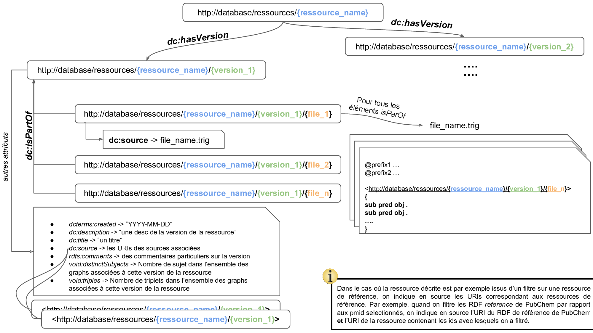

## Metabolite - Diseases Graph Database

This repository contains some usefull methods to provides links between PubChem compound identifiers, litteratures (PMIDs) and MeSH

*GetCID_PMID_associations* is the main test file, where I test the developped functions.

-   **The Database_ressource_version object:**
  This object provide a way to create a new version of a ressource. Information are contained in two majors files:
-   ```ressource_info file```: is the file containing all the descriptive information associated to the created version of the ressource, such as the linkded ressource, the creation date, a description, the list of the associated RDF graphs, etc ...
-   ```data_graph```: Each ressource vesion is composed of a set of triples, organized in one or several named graph. Each of these named-graph are linked to the new version of the ressource in the ```ressource_info file```. A schema representing the process is presented below :



-   **The Elink_ressource_creator object:** 

From a set of Entrez identifiers from a NCBI Entrez database (such as *Pubmed*, *pccomound*, etc ...), named *linking identifiers*, this objects provide a way to extract all associations between those Entrez identifiers and others Entrez identifiers, named *linked identifiers*, from an other NCBI Entrez database, using the **Elink** function from **Eutils** 
```python
Elink_ressource_creator(ressource_name, version, dbfrom, db, ns_linking_id, ns_linked_id, ns_endpoint, primary_predicate, secondary_predicate, namespaces)
``` 
- ```ressource_name```: The ressource name 
- ```version```: The ressource version. If None, date is used
- ```dbfrom```: The NCBI Entrez database for *linking identifiers*
- ```db```: The NCBI Entrez database for *linked identifiers*
- ```ns_linking_id```: a tuple representing namespace name and associated prefix (if one should be added next before the id) for *linking identifiers*
- ```ns_linked_id```: a tuple representing namespace name and associated prefix (if one should be added next before the id) for *linked identifiers*
- ```ns_endpoint```: a tuple representing namespace name and associated prefix (if one should be added next before the id) for endpoints ids
- ```primary_predicate```: a tuple representing the primary predicate with namespace name and predicate name, that will be used to illutrate the relation between linking ids and linked ids
- ```secondary_predicate```: a tuple representing the secondary predicate with namespace name and predicate name, that will be used to illutrate the additionnal relation between linking ids and linked ids in the endpoint graph
- ```namespaces```: a dict containing namespace names as keys and associated rdflib.Namespace() objects as values

Allow to create an empty Elink_ressource_creator object. Once this object is created, all the selected *linking identifiers* can be added to this object using the *append_linked_ids* method.

```python
Elink_ressource_creator.append_linked_ids(id_pack, query_builder)
```
- ```id_pack``` : a list of *linking identifiers* to add to the Elink_ressource_creator object.
- ```query_builder``` : a Eutils QueryService used to request to NCBI server, whcih can be created as :
To build a Eutils QueryService, the following commands may be used :
```python
    apiKey = "0ddb3479f5079f21272578dc6e040278a508"
    query_builder = eutils.QueryService(cache = False,
                                    default_args ={'retmax': 10000000, 'retmode': 'xml', 'usehistory': 'y'},
                                    api_key = apiKey)
```    
The Api_key can be found on the NCBI account.
When an *linking identifier* is added to the Elink_ressource_creator object, a *Eutils* (*Elink* function) request is send to get all the *linked identifiers* associated to the current *linking identifier*. If the request failed (serveur error, bad request, ...) concerned *linking identifiers* are writed in a *linking_ids_request_failed* file, and the function return False.
However, if no literature is associated to the *linking identifier*, it's added to the *linking_ids_without_linked_ids* file.
A *linking identifier***-***linked identifiers* association is describe with the contributor associated to this association. Contributors represent the *link names* associated to the *Elink* results. 
This information is represented in the endpoints files. Once all the selected *linking identifiers* have been added by the ```append_linked_ids``` method, results can be exported.

This function can be used to retrive links for a few number of *linking identifiers*, but does not create RDF triples from this information. This step should be done after using RDFlib serializer applied to the *g_linked_id* and *g_linked_id_endpoint* graph attributes. 
To formalize the *linking identifier***-***linked identifiers* associations in a Knowledge-Graph way, the function *create_CID_PMID_ressource* should be used.

Also, if there is a large numnber of cid, the amount of retrived pmids may be really huge and to avoid overload the memory the function *create_ressource* should also be used.


```python
create_CID_PMID_ressource(out_dir, id_list, pack_size, query_builder, max_size)
```
This function is used to create a new version of the *ressource* and *ressource_endpoints*, by creating all associated named graphs. Also, all *linking identifiers* for which *linked identifiers* was associated are exported in the *successful_linking_ids* file. All the feteched *linking identifier***-***linked identifiers* association are then exported in knowledge graphs at *out_dir*.

-   ```out_dir```: a path to an directory to write output files.
-   ```id_list```: a list of *linking identifiers*
-   ```pack_size```: the *linking identifier* packed size which will be send to the NCBI server. Pack size of 500 or 1000 can really improve computation time, but, there is a limit in the number of *linked identifiers* that can be extracted at the same time. If selected *linked identifiers* have a lot of associated, prefer small pack size to be sure to get all the information.
-   ```query_builder```: a Eutils QueryService used to request to NCBI server
-   ```max_size```: the maximal number of *linking identifier***-***linked identifiers* associations in a RDF file. Formalize a huge amount of association in RDF can be really time and memory consuming. Keep also in mind that there will be 3 triples to build in *ressource_endpoint* graph for one in *ressource* graph.


So as exemple, to get all the literature association of cids contains in the SBML graph:

```python

namespaces = {
    "cito": rdflib.Namespace("http://purl.org/spar/cito/"),
    "compound": rdflib.Namespace("http://rdf.ncbi.nlm.nih.gov/pubchem/compound/"),
    "reference": rdflib.Namespace("http://rdf.ncbi.nlm.nih.gov/pubchem/reference/"),
    "endpoint":	rdflib.Namespace("http://rdf.ncbi.nlm.nih.gov/pubchem/endpoint/"),
    "obo": rdflib.Namespace("http://purl.obolibrary.org/obo/"),
    "dcterms": rdflib.Namespace("http://purl.org/dc/terms/"),
    "fabio": rdflib.Namespace("http://purl.org/spar/fabio/"),
    "mesh": rdflib.Namespace("http://id.nlm.nih.gov/mesh/"),
    "void": rdflib.Namespace("http://rdfs.org/ns/void#"),
    "skos": rdflib.Namespace("http://www.w3.org/2004/02/skos/core")
}

apiKey = "0ddb3479f5079f21272578dc6e040278a508"
query_builder = eutils.QueryService(cache = False,
                                    default_args ={'retmax': 10000000, 'retmode': 'xml', 'usehistory': 'y'},
                                    api_key = apiKey)
# On crée le graph SBML mergé :
smbl_graph = merge_SMBL_and_annot_graphs("data/HumanGEM/HumanGEM.ttl", ["synonyms.trig", "infered_uris.trig", "infered_uris_synonyms.trig"], "data/annot_graphs/2020-04-06/")
# get CID list :
cid_list = extract_ids_from_SMBL_by_URI_prefix(smbl_graph, "http://identifiers.org/pubchem.compound/")
# intialize object :
sbml_cid_pmid = Elink_ressource_creator(ressource_name = "CID_PMID", 
                                        version = "SMBL_2020-15-04", 
                                        dbfrom = "pccompound",
                                        db = "pubmed",
                                        ns_linking_id = ("compound", "CID"),
                                        ns_linked_id = ("reference", "PMID"),
                                        ns_endpoint = ("endpoint", ""),
                                        primary_predicate = ("cito", "isDiscussedBy"),
                                        secondary_predicate = ("cito", "citeAsDataSource"),
                                        namespaces = namespaces)
# Launch fetching
sbml_cid_pmid.create_ressource("data/", cid_list, 1000, query_builder, 5000000)
# get all pmids :
sbml_all_pmids = sbml_cid_pmid.all_linked_ids
```
* * *

PubChem provides RDF files from his ftp server which can be dowload and associated to a ressource using the ```dowload_pubChem```.
This function allow to dowload all the files associated to a particular directory in the ftp server and to create a new version of the associated ressource, bringing information from the void.ttl file.

```python
dowload_pubChem(dir, request_ressource, out_path)
```
-   ```dir```: the path to the directory/file to fetch in the ftp server from ftp://ftp.ncbi.nlm.nih.gov/pubchem/RDF/
-   ```request_ressource```: the name of the ressource as indicated in the void.ttl file.
-   ```out_path```: a path to a directory to write output files

Using: 
```python
dowload_pubChem("reference", "reference", "path/to/out/")
```
A new version of the ressource *reference* is created from the RDF files dowloaded from the ftp server.
* * *

But these files contains a huge amount of data and only a part is related to our compounds.
```parse_pubchem_RDF``` is a function which is used to create a new ressource, from an exisyting reference ressource, by parsing files and extract only triples for which the subjet is contains in a set of defined subject. By default this new ressource shoud be called '*xxxFiltered*'.
By providing the ressource_info file (containing the graph describing the reference ressource), a path to the directory containing all the associated named graphs and a set of identifiers, this function create a *Filtered* ressource from the reference ressource, with ressource_info graph and all the associated named graph derived from the originals. 

```python
parse_pubchem_RDF(input_ressource_directory, all_ids, prefix, input_ressource_file, input_ressource_uri, out_dir, filtered_ressource_name, input_ids_uri, isZipped, namespace_dict, version, separator)
```

-   ```input_ressource_directory```: a path to the directory containing all the RDF files referenced has 'partOf' the reference source in the input_ressource_file
-   ```input_ressource_file```: a ressource_info file containing informations about the reference ressource.
-   ```all_ids```: a list of all the ids that should be used to parse the RDF files associated to the ressource.
-   ```prefix```: the string representing the prefix that shoud be added to the id to create the URI of subjects in the file.
-   ```input_ressource_uri```: the rdflib.UriRef associated to the reference ressource in the input_ressource_file
-   ```out_dir```: a path to an directory to write output files.
-   ```filtered_ressource_name```: the name of the new ressource, creating from the parsing of the reference file.
-   ```input_ids_uri```: the rdflib.UriRef associated to the reference ressource from which the set of all_ids was created.
-   ```isZipped```: is the reference files are zipped: True/False.
-   ```namespace_dict```: dict containing all the used namespaces.
-   ```version```: the version name. If None, the date will be choose by default.
-   ```separator```: the separator used in triples (.ttl) files to separated subject/predicate/object: \t or ' '
    """


As Exemple, to filter the reference ressource to only have thoose involving with the studied compounds: 
Here we are using all_pmids since it's not usefull to get information about publications that we can not link to our compounds. **but it's the same for the other ressource especially Compounds! Because we also want information about Compounds even if we can't associated some litterature to them ! We want them in the Graph !!** 
```python
parse_pubchem_RDF(input_ressource_directory = "path/to/reference/version_X/", 
                  all_ids = all_pmids,
                  prefix = "reference:PMID", 
                  out_dir = "path/out/",
                  input_ressource_file = "data/PubChem_References/reference/ressource_info_reference_version_X.ttl",
                  input_ressource_uri = rdflib.URIRef("http://database/ressources/PubChem/reference/version_X"),
                  filtered_ressource_name = "referenceFiltered",
                  input_ids_uri = rdflib.URIRef("http://database/ressources/CID_PMID/version_X"),
                  isZipped = True,
                  namespace_dict = namespaces,
                  version = None,
                  separator = '\t')
```
* * *
A issue was also found in the pc_reference2chemical_diseases.ttl files. This files provides associations between pmids and Supplementary Concept MeSH Records (SCRs) which are composed of two principals types Diseases and Chemicals. The predicated used in this associations was *cito:discusses* whcih is the reverse property of *cito:isDiscussedBy*. But, *cito:isDiscussedBy* was already used to annotated associations between cid and pmids, so to prevent errors with inferences, I choose to change all the *cito:discusses* predicates in this files with *fabio:hasSubjectTerm* which is explicitly defined to be used with MeSH terms.

A second issue is found in the pc_compound_type.ttl.gz file where currently two prefix lines for bp and nci and present few lines after the header which cause errors during the parsing. The proposed solution is simply to cut and paste this line in the header.

* * *
The main issue about PubChem RDF Reference files provided in the ftp server, is that they only provide triples with the *fabio:hasSubjectTerm* predicates, which correspond to secondary mesh associated to the pmid but don't provide the *fabio:hasPrimarySubjectTerm* which represent the main topics of the artcile, which is an import source of information.


The function ```REST_ful_bulk_download``` is designed to send request to the PubChem RDFful REST server and get this missing information. Using a specified domain and predicate a request will be send to get all the associated triples. But, the server can't send more than 10000 records at the same time, so the function will export each packets of 10000 triples in different files and increment the offset parameter o the request until get all the triples. The function return a list of offsets for which there was a server errors (HTTP status > 200), for which it would be necessary to relaunch the function. All the fetched triples will be used to create a new version of the related ressource. Due to the large amount of data which can be retrieved, triples are distributed in succesives named graph with a maximal size of 10.000.000 triples.

```python
REST_ful_bulk_download(graph, predicate, out_name, start_offset, out_dir, ressource_name, namespaces_list, namespaces_dict, version):
```

-   ```graph```: the subject database of the triples to fetch from the REST api of PubChem.
-   ```predicate```: the predicate of the triple (with the prefix in a turtle syntax)
-   ```out_name```: the name of output RDF file
-   ```start_offset```: the offset used to start (Cf. PubChem REST api doc)
-   ```out_dir```: a path to an directory to write output files
-   ```ressource_name```: the name of the created ressource
-   ```namespace_list```: a list of the namespaces that should be associated to the named-graph
-   ```namespace_dict```: a dict containing all the used namespaces.
-   ```version```: the version name. If None, the date will be choose by default.


If for any reasons the function failed, the function can be restarted at the last offset using the ```start_offset``` parameter.
As, example, to get all the triples from the *reference* database containing the *fabio:hasPrimarySubjectTerm* predicate, we can use: 

```python
requests_failed = REST_ful_bulk_download(graph = 'reference', predicate = 'fabio:hasPrimarySubjectTerm', out_name = 'PrimarySubjectTerm',
                                         start_offset = 0, out_dir = "path/to/out/",
                                         ressource_name = "PrimarySubjectTerm", namespaces_list = ["reference", "fabio", "mesh"],
                                         namespaces_dict = namespaces,
                                         version = None)
```

With this function 52178606 (v.2020-03-20) of triples involving a pmid and a mesh with the predicate *fabio:hasPrimarySubjectTerm* was found.
After this, all the files may be collapse as one, compress and send to the function ```parse_pubchem_RDF``` to only extract thoose for which we have an associated PubChem CID.

And then we can use the ```parse_pubchem_RDF``` to parse the file.
For all named graph which were wrote using an rdflib serialize process, the separator in the resulting turtle file is always ' '.
```python
parse_pubchem_RDF(input_ressource_directory = "path/to/PrimarySubjectTerm/version_X/",
                  all_ids = all_pmids,
                  prefix = "reference:PMID",
                  out_dir = "path/to/out/",
                  input_ressource_file = "path/to/PrimarySubjectTerm/ressource_info_PrimarySubjectTerm_version_X.ttl",
                  input_ressource_uri = rdflib.URIRef("http://database/ressources/PrimarySubjectTerm/version_X"),
                  filtered_ressource_name = "PrimarySubjectTermFiltered",
                  input_ids_uri = rdflib.URIRef("http://database/ressources/CID_PMID/version_X"),
                  isZipped = True,
                  namespace_dict = namespaces,
                  version = None,
                  separator = ' ')
```
* * *
MeSH RDF triples must also be download in the same way. This can be do using the function ```dowload_MeSH```:
```python
dowload_MeSH(out_dir, namespaces_dict)
```
-   ```out_dir```: a path to an directory to write output files
-   ```namespaces_dict```: a dict containing all the used namespaces.
So to download the whole MeSH RDF, ce can simply do :

```python
dowload_MeSH("path/to/out/", namespaces)
```


* * *
The same process can be done for pubChem compounds.
**But when we want to filter the PubChem Compound RDF we must use all the CID, even if they failed to append litterature !!**

## Ontology

The differents RDF stores and RDFS/OWL Schema can be dowload in: 
- MeSH
  - RDF: ```ftp://ftp.nlm.nih.gov/online/mesh/rdf/mesh.nt.gz```
  - Schema: ```ftp://ftp.nlm.nih.gov/online/mesh/rdf/vocabulary_1.0.0.ttl```
- ChEBI:
  - Schema: ```ftp://ftp.ebi.ac.uk/pub/databases/chebi/ontology/chebi.owl```
- cito
  - Schema: ```http://purl.org/spar/cito.ttl```
- fabio:
  - Schema: ```http://purl.org/spar/fabio.ttl```
- Dublin Core:
  - Schema: ```https://www.dublincore.org/specifications/dublin-core/dcmi-terms/dublin_core_terms.nt```

Then, a owl file was build to provide logical links between entity to infer association between PubChem CID and MeSH associated to a diseases. The file is in new_inferences/doc_voc_test.ttl (details in notes)

After loading all th named graph associated to ressources: cid_pmid, cid_pmid_endpoint, referenceFiltered, PrimarySubjectTermFitlered, compoundFiltered, the folowing request may be used to get to cid - mesh diseases asociations.

```
select ?cid ?mesh (count(?pmid) as ?c) where {
	?cid cito:isDiscussedBy ?pmid
	?pmid fabio:hasSubjectTerm ?mesh
	?mesh a voc:DiseaseLinkedMesH
} group by (?mesh) ORDER BY DESC(?c)
```
This request actualy work on corese !

## Virtuoso:

Docker compose is available using the workflow.sh
The *share* directory must contains all the data that have to be imported in virtuoso.
Data are organized in different directory, each corresponding to a particular ressource.
CID_PMID: contains all *.trig* RDF files the corresponding metadata *.ttl* files associated to the ressource CID_PMID you want to load.

During the loading of the service it's important to check the result of the command *select * from DB.DBA.LOAD_LIST where ll_error IS NOT NULL;* which is checking about import errors.
the service will be available at *http://localhost:9980/sparql* 

The query which may be used to get all the cid - MeSH diseases assocaition with the number of associated pmid is :  

```
DEFINE input:inference 'schema-inference-rules'
PREFIX rdf: <http://www.w3.org/1999/02/22-rdf-syntax-ns#>
PREFIX rdfs: <http://www.w3.org/2000/01/rdf-schema#>
PREFIX xsd: <http://www.w3.org/2001/XMLSchema#>
PREFIX owl: <http://www.w3.org/2002/07/owl#>
PREFIX meshv: <http://id.nlm.nih.gov/mesh/vocab#>
PREFIX mesh: <http://id.nlm.nih.gov/mesh/>
PREFIX voc: <http://myorg.com/voc/doc#>
prefix cito: <http://purl.org/spar/cito/>
prefix fabio:	<http://purl.org/spar/fabio/> 
prefix owl: <http://www.w3.org/2002/07/owl#> 
prefix void: <http://rdfs.org/ns/void#>

select ?cid ?mesh ?name ?countdist where {
	
	?mesh rdfs:label ?name .	
	{
		select ?mesh ?cid (count(distinct ?pmid) as ?countdist) where {
		?cid cito:isDiscussedBy ?pmid .
		?pmid fabio:hasSubjectTerm|fabio:hasSubjectTerm/meshv:hasDescriptor ?mesh .
		?mesh a meshv:TopicalDescriptor .
		
		?mesh meshv:treeNumber ?tn .
		FILTER(REGEX(?tn,"C"))
		}
		group by ?mesh ?cid
		
	}
}ORDER BY DESC(?countdist)

```
Quelques explications :
    - Si on découpe la requête en deux partie c'est parce que sinon on ne peut pas groupby ?mesh ?cid et aussi affichier directement le name associé car il ne s'agit pas d'un élément d'aggrégation.
    - on doit **absolument** utilisé un *distinct* sur le comptage des pmids car : 1) Un même MeSH peut être inclus plusieurs fois (ex avec différents Qualifiers) et surtout quand 1 MeSH a souvent plusieurs tree number, ce qui fait que tout cela duplique les lignes ! et si on compte direct le nombre de pmid c'est faux !!

## Improve ID coverage using UniChem & Identfiers.org :

Unichem is a database which provides usefull equivalences between identifiers between databases. For example ChEBI:37327 is equivalent to PubchemCID:5372720 and also to chembl: 	CHEMBL68500, etc ...
On an other way, Identifiers.org provides several URI which can be associated to a same ressource, for example: https://identifiers.org/CHEBI:36927, or 		https://www.ebi.ac.uk/chebi/searchId.do?chebiId=CHEBI:36927. But this database is incomplete and some URIs which corresponds to the RDF representation of the ressource like implemented by the provided may be missing. For example http://purl.obolibrary.org/obo/CHEBI_ and http://rdf.ncbi.nlm.nih.gov/pubchem/compound/CID are missing. So this information were added manualy

The goal of the functions provide in get_info_from_UniChem is to merge information from Identifiers.org adn UniChem to provided a set of equivalent URI which represent the same molecule between ressources, and between URIs associated to ressources.
So, we can separate the equivalences in two different types :
  - intra-ressource: For an identifier of a molecule in a defined ressource, if the ressource have more than one possible URI, we can create a set of exactly-matching URI intra ressource for this molecule. Example: If ChEBI have 2 URIs like 'https://identifiers.org/CHEBI:' and 'http://purl.obolibrary.org/obo/CHEBI_', for one ChEBI idenfiers, we can make un exactly matching equivalence between the both URIs such as 'https://identifiers.org/CHEBI:36927' **skos:exactMatch** 'http://purl.obolibrary.org/obo/CHEBI_36927' With **skos:exactMatch** we indicate that the both concepts have exactly the same meaning, so we can pass from one to each other directly without errors. This property is so *Symetric* and *Transitive*.
  - inter-ressource: For an identifier of a molecule, UniChem may have provide us an equivalence in an other database.  For example ChEBI:37327 is equivalent to PubchemCID:5372720. So we will create an associations between this two identifiers using the predicate skos:closeMatch and **ONLY** for only one URI of each ressource. Indeed, since each URI intra ressource are linkded by a predicate skos:exactMatch which is a transitive property, we only have to provide the new association between the two ressource with one URI of each, to propagate it to all ressources related URIs. **skos:closeMatch** indicates that two concepts are sufficiently similar and that the two can be used interchangeably, nevertheless, this  is not transitive, to avoid spreading  equivalence errors.

Note that all existing identifiers in the ressources provided by UniChem are not returned, but only those for which UniChem have an equivalence in a other database, but to build the intra-ressource equivalence we need to have all the ids, or at list all those which are present in the SBML. So, to avoid this biais, the RDF graph of the SBML is initialy loaded to extract all the existing identifiers, which will be complete by those provided by UniChem.

With all these new triples referring new associations between URIs we can used it to build a graph and with a SPARQL request, try to extract new identifiers for each species from those already annotated.

The result may be called a URI-Graph.

```python
create_graph(path_to_graph, ressources_ids, ressource_uris, namespaces, path_out, version)
```
-   ```path_to_graph```: The path to a SBML graph in a turtle format.
-   ```ressources_ids```: A dict containing ressource name as key and ressource id in the UniChem database as values. Ressource ids may be found at https://www.ebi.ac.uk/unichem/ucquery/listSources
-   ```ressource_uris```: a dict containing all the possible ressources URIs associated to a ressource.
-   ```namespaces```: a dict of namespaces
-   ```path_out```: a path to write output files
-   ```version```: a vesion name. If None date is used by default.

### Examples of used parameters: 
```python
ressources_ids = {
    "chebi": '7',
    "pubchem": '22',
    "kegg": '6',
    "hmdb": '18',
    "lipidmaps": '33'            
}

ressource_uris = {
    "chebi": ["http://identifiers.org/chebi/CHEBI:", "http://purl.obolibrary.org/obo/CHEBI_", "https://www.ebi.ac.uk/chebi/searchId.do?chebiId=CHEBI:"],
    "pubchem": ["http://identifiers.org/pubchem.compound/", "http://rdf.ncbi.nlm.nih.gov/pubchem/compound/CID"],
    "kegg": ["http://identifiers.org/kegg.compound/", "https://www.kegg.jp/entry/"],
    "hmdb": ["http://identifiers.org/hmdb/"],
    "lipidmaps": ["http://identifiers.org/lipidmaps/"] 
}

graph_original_uri_prefix = {
    "chebi": "http://identifiers.org/chebi/CHEBI:",
    "pubchem": "http://identifiers.org/pubchem.compound/",
    "kegg": "http://identifiers.org/kegg.compound/",
    "hmdb": "http://identifiers.org/hmdb/",
    "lipidmaps": "http://identifiers.org/lipidmaps/"
}
```
Note that Keys of dict must be the same in all graphs.
By loading the SBML graph and the new graph containing identifiers equivalence in an RDF Store like Virtuoso, we can compute SPARQL query to extract all informations:
**Initials URIs in the SMBL graph MUST be identifiers.org URIS !**
This request may be separated in 3 main parts :
And **version** must be fill in the Graph URI. 
#### part 1 : Get synonyms of existing uris : 
As indicated in the Graph URI, this file should be named *synonyms.trig*
```SQL
DEFINE input:inference 'schema-inference-rules'
prefix SBMLrdf: <http://identifiers.org/biomodels.vocabulary#>
prefix bqbiol: <http://biomodels.net/biology-qualifiers#>
prefix mnxCHEM: <https://rdf.metanetx.org/chem/>
prefix chebi: <http://purl.obolibrary.org/obo/CHEBI_>
prefix model: <http:doi.org/10.1126/scisignal.aaz1482#>
prefix cid:   <http://rdf.ncbi.nlm.nih.gov/pubchem/compound/>
construct {
	 GRAPH <http://database/ressources/annotation_graph/version/synonyms> { ?specie bqbiol:is ?ref_syn . }
}where {
	?specie a SBMLrdf:Species ;
		bqbiol:is ?ref .
	?ref skos:exactMatch ?ref_syn option(t_distinct) .

}
```
For a specie, we extract all the current uris associated to the predicate bqbiol:is, and for those elements we extract uris which are in skos:exactMatch with them, so their intra-ressources URI synonyms

#### part 2  : Extraction of infered equivalent uris :
As indicated in the Graph URI, this file should be named *infered_uris.trig*
```SQL

DEFINE input:inference 'schema-inference-rules'
prefix SBMLrdf: <http://identifiers.org/biomodels.vocabulary#>
prefix bqbiol: <http://biomodels.net/biology-qualifiers#>
prefix mnxCHEM: <https://rdf.metanetx.org/chem/>
prefix chebi: <http://purl.obolibrary.org/obo/CHEBI_>
prefix model: <http:doi.org/10.1126/scisignal.aaz1482#>
prefix cid:   <http://rdf.ncbi.nlm.nih.gov/pubchem/compound/>
construct {
	GRAPH <http://database/ressources/annotation_graph/version/infered_uris> { ?specie bqbiol:is ?otherRef . }
}where {
		?specie a SBMLrdf:Species ;
			bqbiol:is ?ref .
		?ref skos:closeMatch ?otherRef .
		FILTER (
			not exists { ?specie bqbiol:is ?otherRef }
			&&
			not exists {?ref skos:exactMatch ?otherRef option(t_distinct)}
		)

}
```
For a specie, we extract all the current uris associated to the predicate bqbiol:is, and for those elements we extract uris which are associated to the element with a skos:closeMath predicate, corresponding to equivalent URIs from identfiers equivalence provided by UniChem. **BUT**, we specifie that the extracted URI **must** not ne already known in the current graph *not exists { ?specie bqbiol:is ?otherRef }* **AND** that the extracted URI are not a synonym of the current annotate URIs (*not exists {?ref skos:exactMatch ?otherRef option(t_distinct)}*), because of *skos:exactMatch* is a sub-property of *skos:closeMatch*, by searching equivalent URIs using skos:closeMatch, we may extract synonyms of the already annotated URIs, but this is already done by the first request.

#### part 3 : Extraction of synonymes of infered equivalent uris :
As indicated in the Graph URI, this file should be named *infered_uris_synonyms.trig*
```SQL

DEFINE input:inference 'schema-inference-rules'
prefix SBMLrdf: <http://identifiers.org/biomodels.vocabulary#>
prefix bqbiol: <http://biomodels.net/biology-qualifiers#>
prefix mnxCHEM: <https://rdf.metanetx.org/chem/>
prefix chebi: <http://purl.obolibrary.org/obo/CHEBI_>
prefix model: <http:doi.org/10.1126/scisignal.aaz1482#>
prefix cid:   <http://rdf.ncbi.nlm.nih.gov/pubchem/compound/>
construct {
	GRAPH <http://database/ressources/annotation_graph/version/infered_uris_synonyms> { ?specie bqbiol:is ?otherRef_syn . }
}where {
	?otherRef skos:exactMatch ?otherRef_syn option(t_distinct) .
	FILTER (
		not exists { ?specie bqbiol:is ?otherRef_syn }
		&&
		not exists { ?ref skos:exactMatch ?otherRef_syn option(t_distinct) }
	)
	{
		select ?specie ?otherRef ?ref where {
		?specie a SBMLrdf:Species ;
			bqbiol:is ?ref .
		?ref skos:closeMatch ?otherRef .
		FILTER (
			not exists {?specie bqbiol:is ?otherRef }
      &&
    		not exists { ?ref skos:exactMatch ?otherRef option(t_distinct) }
		)

		}
	}
}
```
For a specie, we extract all the current uris associated to the predicate bqbiol:is, and for those elements we extract uris which are associated to the element with a skos:closeMath predicate, corresponding to equivalent URIs from identfiers equivalence provided by UniChem. **BUT**, we check that this URIs are not already known in the current annotation **AND** that the *?otherRef* is not a synonym of ?ref (becacuse *skos:exactMatch* is a sub-property of *skos:closeMatch*). And, for those URIs, we extract all their direct synonyms using *skos:exactMatch* and we check that this synonyms are not already present in the annotation (*not exists { ?specie bqbiol:is ?otherRef_syn }*) **and**, that this synonyms are not synonyms of already known annotation (*not exists { ?ref skos:exactMatch ?otherRef_syn option(t_distinct) }*), like those we were added with the query !

Finally it's really more computionnaly efficient to separate this work in three diffenret queries.


### To count the number of added URIs from a specific pattern
#### (#Part 1 ) 
```SQL

DEFINE input:inference 'schema-inference-rules'
prefix SBMLrdf: <http://identifiers.org/biomodels.vocabulary#>
prefix bqbiol: <http://biomodels.net/biology-qualifiers#>
prefix mnxCHEM: <https://rdf.metanetx.org/chem/>
prefix chebi: <http://purl.obolibrary.org/obo/CHEBI_>
prefix model: <http:doi.org/10.1126/scisignal.aaz1482#>
prefix cid:   <http://rdf.ncbi.nlm.nih.gov/pubchem/compound/>
select count(distinct(?ref_syn)) where {
	?specie a SBMLrdf:Species ;
		bqbiol:is ?ref .
	?ref skos:exactMatch ?ref_syn option(t_distinct) .
  	FILTER ( STRSTARTS(STR(?ref_syn), "/pattern/"))
}

```

#### (#Part 2) 
```SQL
DEFINE input:inference 'schema-inference-rules'
prefix SBMLrdf: <http://identifiers.org/biomodels.vocabulary#>
prefix bqbiol: <http://biomodels.net/biology-qualifiers#>
prefix mnxCHEM: <https://rdf.metanetx.org/chem/>
prefix chebi: <http://purl.obolibrary.org/obo/CHEBI_>
prefix model: <http:doi.org/10.1126/scisignal.aaz1482#>
prefix cid:   <http://rdf.ncbi.nlm.nih.gov/pubchem/compound/>
select count(distinct(?otherRef)) where {
		?specie a SBMLrdf:Species ;
			bqbiol:is ?ref .
		?ref skos:closeMatch ?otherRef .
		FILTER (
			not exists { ?specie bqbiol:is ?otherRef }
			&&
			not exists {?ref skos:exactMatch ?otherRef option(t_distinct)}
      &&
      STRSTARTS(STR(?otherRef), "/pattern/")
		)

}
```

#### (#Part 3)

```SQL

DEFINE input:inference 'schema-inference-rules'
prefix SBMLrdf: <http://identifiers.org/biomodels.vocabulary#>
prefix bqbiol: <http://biomodels.net/biology-qualifiers#>
prefix mnxCHEM: <https://rdf.metanetx.org/chem/>
prefix chebi: <http://purl.obolibrary.org/obo/CHEBI_>
prefix model: <http:doi.org/10.1126/scisignal.aaz1482#>
prefix cid:   <http://rdf.ncbi.nlm.nih.gov/pubchem/compound/>

select count(distinct(?otherRef_syn)) where {
	?otherRef skos:exactMatch ?otherRef_syn option(t_distinct) .
	FILTER (
		not exists { ?specie bqbiol:is ?otherRef_syn }
		&&
		not exists { ?ref skos:exactMatch ?otherRef_syn option(t_distinct) }
    &&
    STRSTARTS(STR(?otherRef_syn), "/pattern/")
	)
	{
		select ?specie ?otherRef ?ref where {
		?specie a SBMLrdf:Species ;
			bqbiol:is ?ref .
		?ref skos:closeMatch ?otherRef .
		FILTER (
      		not exists {?specie bqbiol:is ?otherRef }
      		&&
      		not exists { ?ref skos:exactMatch ?otherRef option(t_distinct) }
		)
		}
	}
}
```
